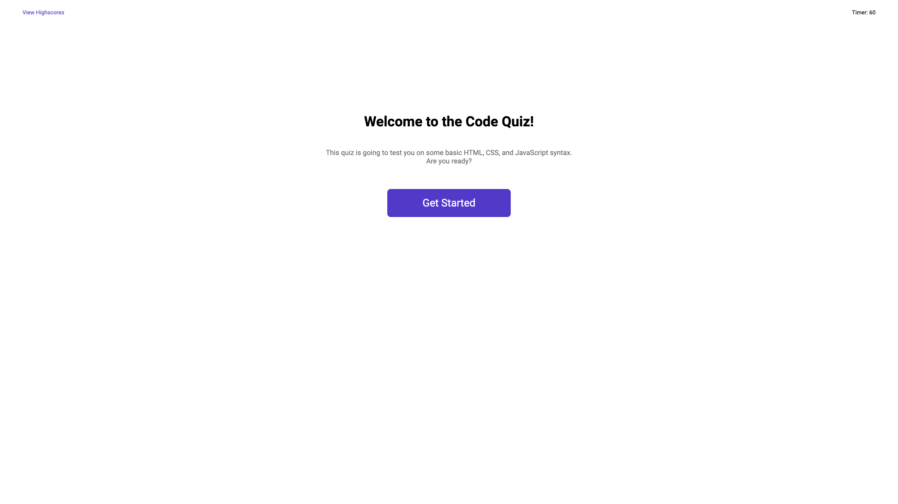

# Code Test | For Beginners

## What is this?

This is a code quiz that has been designed using DOM manipulation.

### Website Link

 https://opaleone.github.io/Code-Test-for-Beginners/

>This is an image representing the landing page

## How is it done

Firstly, I had to break this down into 3 main parts. 

    Timer
    Question Display
    Leaderboard

## Timer
---

### Timer Image

I started with my timer. I created a timer that counts down from 60 seconds by decrementing a variable I created by 1 every 1000 miliseconds.

Next, I created a function that starts the quiz whenever a button is pressed. This function also starts my timer which doubles as a score.

## Question Display
---

### Question Image 

Here, I began my functions for displaying the question. I separated this into two different functions.

The first function I wrote was how to display a question. This simply tells Javascript which questions to display and when to display them using IF statement and FOR loops. When there are no more questions left to display, determined by COUNT variable, the function will hide the question section, place the score in LOCAL STORAGE and run the function to display the leaderboard.

The first function I wrote was determines when Javascript will proceed to the next question. It listens for a button press then, using an IF statement, determines, based of my correctAnswerIndex variable, if the button pressed hold the correct answer. If so, it adds 6 to the timer, which is score. If the answer is incorrect, it subtracts 12 from the timer.

## Leaderboard
---

### Leaderboard Image

The last step of this quiz was the leaderboard. The intent of this section to grab the last score of the user and display this on the screen for them both after the complete the quiz, and whenever the click the View Highscore button on the top left of the webpage. This required two functions as well.

The first function is to display the leaderboard after the quiz is finished.    
    
    This function is called in the ELSE of the IF statement within the displayQuestion function. 
    
It appends an h1 element and an p element within the leaderboard section of the HTML file and changes their text content to show the last score of the user.

The next function does the same thing as the last function. However, there is one important line added to this function. It hides the landing page whenever it is clicked.

## Credits

The University of Texas - Austin

[StackOverflow.com](https://stackoverflow.com/)

[MDN Documentation](https://developer.mozilla.org/en-US/docs/Web/JavaScript)

[W3-Schools](https://www.w3schools.com/js/)

## License

Please refer to license in the repository.

